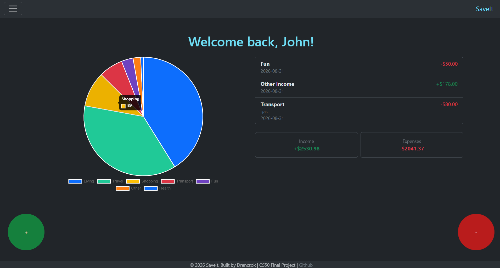
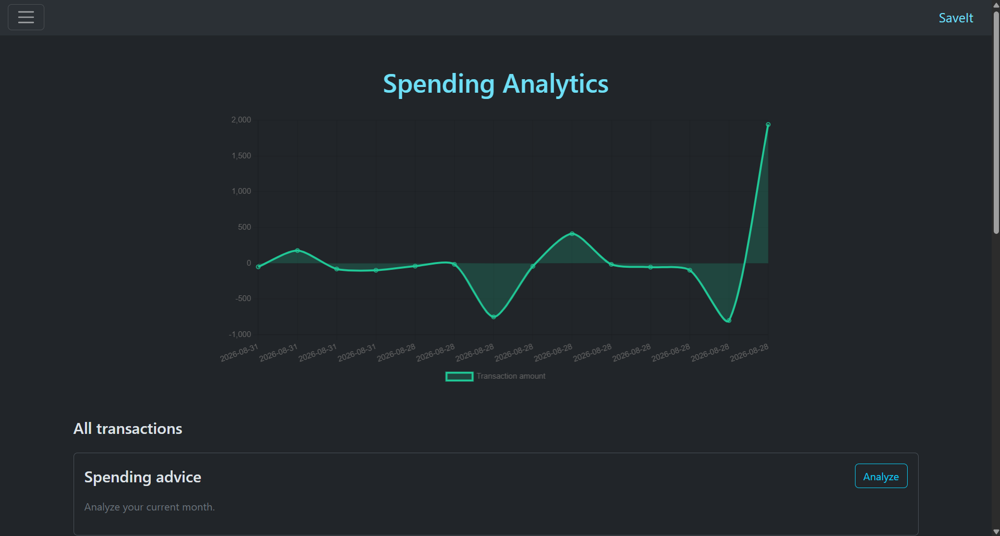
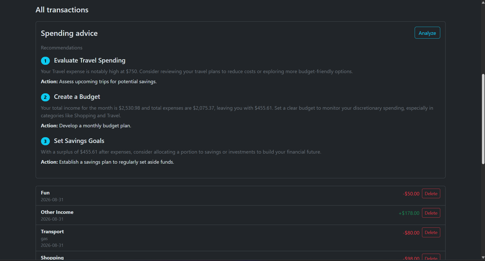
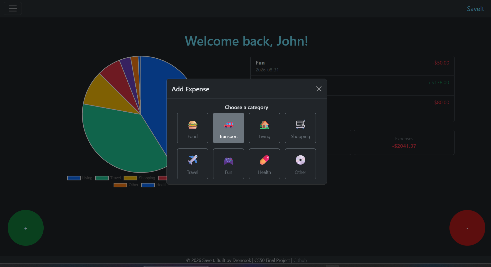
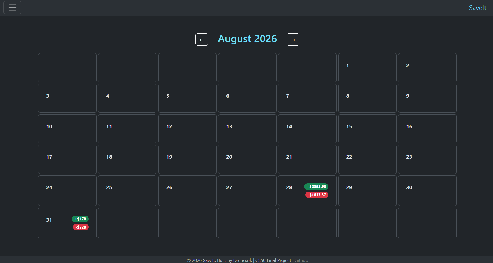

# SaveIt

SaveIt is a personal expense tracker built with Flask and SQLite. It helps users record income and expenses, see spending trends, review transactions by month, and receive concise AI-generated budgeting suggestions based on their current-month activity.

## Screenshots

## Dashboard



## Spending Analytics



## AI Powered Spending Advice



## Add Expense



## Calendar 



> **In progress:** I am building AI-powered receipt scanning. The goal is to upload a receipt, extract the merchant, date, amount, and likely category, then let the user review the result before SaveIt creates the transaction.

## Features

- Secure account registration, login, logout, password changes, and username updates
- Password hashing with Werkzeug
- CSRF protection for state-changing requests
- Income and expense tracking with categories and optional descriptions
- Dashboard with income, expense, recent-transaction, and category-spending summaries
- Analytics page with transaction history and charts
- Monthly calendar view of daily income and expenses
- AI-generated spending recommendations from current-month category totals
- Per-user data isolation: users can view and delete only their own transactions

## Planned: receipt scanning

The receipt-scanning workflow is being developed with privacy and confirmation in mind:

1. A signed-in user uploads a receipt image.
2. An AI service extracts candidate transaction details.
3. SaveIt displays those details in an editable review form.
4. The transaction is saved only after the user confirms it.

The scanner will not silently add transactions. Receipt images and extracted data should be handled as sensitive financial information.

## Tech stack

- Python and Flask
- SQLite
- Jinja templates, Bootstrap, Chart.js, and custom CSS
- Flask-WTF for CSRF protection
- Werkzeug security helpers for password hashing
- OpenAI API for optional spending advice and planned receipt analysis

## Project structure

```text
Expense Tracker/
├── app/
│   ├── __init__.py       # Application factory and extension setup
│   ├── auth.py           # Authentication helpers and login protection
│   ├── database.py       # SQLite connection and schema initialization
│   ├── routes.py         # Web routes and application logic
│   └── schema.sql        # Database schema
├── static/               # Styles and images
├── templates/            # Jinja HTML templates
├── tests/                # Automated tests
├── app.py                # Flask application entry point
├── config.py             # Environment-based configuration
└── requirements.txt      # Python dependencies
```

## Getting started

### 1. Clone the repository

```bash
git clone https://github.com/DRencsok/expense-tracker.git
cd "Expense Tracker"
```

### 2. Create and activate a virtual environment

**Windows PowerShell**

```powershell
py -m venv .venv
.\.venv\Scripts\Activate.ps1
```

**macOS / Linux**

```bash
python3 -m venv .venv
source .venv/bin/activate
```

### 3. Install dependencies

```bash
pip install -r requirements.txt
```

### 4. Configure environment variables

Create a local `.env` file in the project root:

```env
SECRET_KEY=generate-a-long-random-secret-here
OPENAI_API_KEY=your-openai-api-key
```

`SECRET_KEY` is required. `OPENAI_API_KEY` is needed only for the AI spending-advice feature while it is enabled.

Never commit `.env`, API keys, receipt images, or a database containing real user data.

### 5. Run the application

```bash
flask --app app run
```

Then open the local address displayed by Flask, usually `http://127.0.0.1:5000`.

## Testing

Run the automated test suite with:

```bash
pytest
```

The tests directory is being expanded to cover authentication, transaction validation, authorization, CSRF protection, and receipt-scanning review flows.

## Security and privacy

- Passwords are hashed; they are never stored as plaintext.
- SQL queries use parameters rather than string interpolation.
- Transaction queries are scoped to the signed-in user.
- CSRF protection is enabled for forms and the AI-advice request.
- Secrets are loaded from environment variables and `.env` is excluded from Git.
- AI features should send only the minimum data needed for the requested analysis.

## Future improvements

- Receipt upload, extraction, review, and confirmation flow
- Editable transactions
- Test coverage and continuous integration
- Export transactions to CSV
- Budget limits and notifications
- Deployment configuration and a production database

## Author

Built by [Drencsok](https://github.com/DRencsok) as a CS50 final project and portfolio project.
